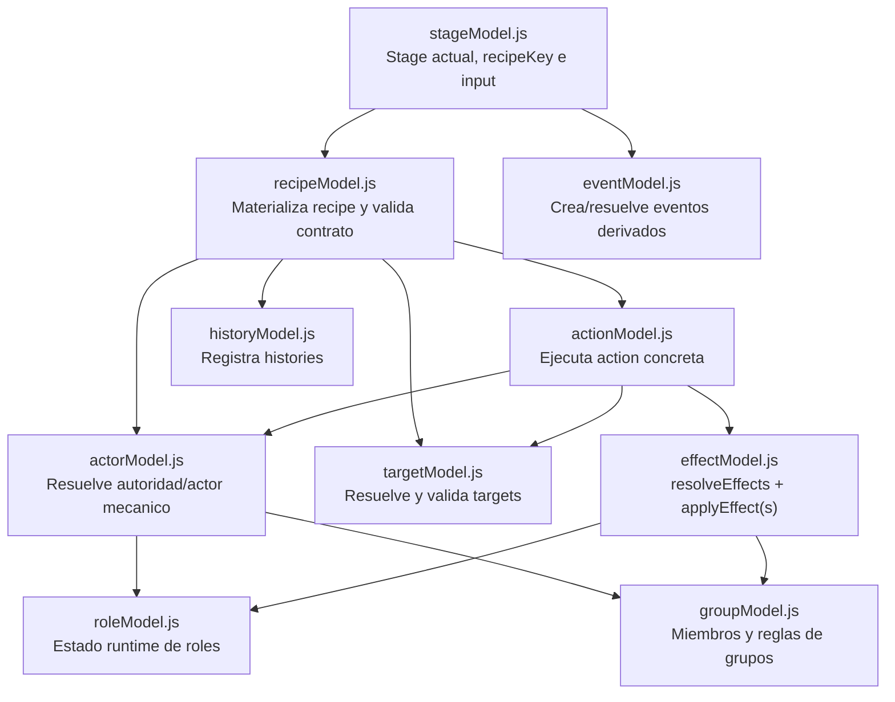

# Actor model

`actorModel.js` centraliza la resolucion de autoridad mecanica para ejecutar
recipes/actions. No representa narrativa, UI ni ownership visual.

## Responsabilidad

`actorModel.js` responde a una pregunta concreta:

> Quien tiene autoridad mecanica para ejecutar esta recipe/action en este
> contexto?

No aplica efectos, no valida targets y no escribe history.

## Relacion entre modelos



## Flujo mecanico

```mermaid
sequenceDiagram
  participant Stage as stageModel
  participant Recipe as recipeModel
  participant Actor as actorModel
  participant Target as targetModel
  participant Action as actionModel
  participant Effect as effectModel
  participant History as historyModel
  participant Event as eventModel

  Stage->>Recipe: resolveRecipe(session, recipe, input, context)
  Recipe->>Actor: resolveRecipeActor(...)
  Recipe->>Target: resolver targets desde input
  Recipe->>Action: resolveAction(session, action, input, context)
  Action->>Actor: getActionActors(session, actorIds)
  Action->>Target: validateActionTargets(...)
  Action->>Effect: resolveEffects(...)
  Effect-->>Action: finalEffects, blockedEffects, derivedEffects
  Action->>Effect: applyEffects(finalEffects)
  Action-->>Recipe: action result
  Recipe->>History: appendRecipeHistory(...)
  Recipe-->>Stage: recipe result
  Stage->>Event: processActionResultEvents(...)
```

## Contrato

Entrada esperada:

```js
{
  session,
  recipe,
  input,
  stage
}
```

Salida normalizada:

```js
{
  actorType: 'role' | 'group' | 'system' | 'director',
  actorIds: [],
  actors: [],
  primaryActor: null,
  authority: 'role' | 'group' | 'system' | 'director'
}
```

Ejemplo role:

```js
{
  actorType: 'role',
  actorIds: ['role_inspects-0'],
  actors: [role],
  primaryActor: role,
  authority: 'role'
}
```

Ejemplo group:

```js
{
  actorType: 'group',
  actorIds: ['role_set_out_of_play-0', 'role_set_out_of_play-1'],
  actors: [roleA, roleB],
  primaryActor: roleA,
  authority: 'group'
}
```

Ejemplo system/director:

```js
{
  actorType: 'system',
  actorIds: [],
  actors: [],
  primaryActor: null,
  authority: 'system'
}
```

## Diferencia con roleModel.js

`roleModel.js` gestiona estado runtime propio de roles:

- bloqueos de cambios de propiedad;
- expiracion de bloqueos;
- revision de bloqueos en fronteras de stage/pool/cycle/session.

`actorModel.js` gestiona autoridad de ejecucion:

- interpreta `recipe.actor`;
- normaliza `actorIds`;
- resuelve roles actores efectivos;
- distingue `role`, `group`, `system` y `director`.

Un role puede ser actor, target o simple entidad de estado. Por eso `roleModel`
no debe absorber la responsabilidad de `actorModel`.
