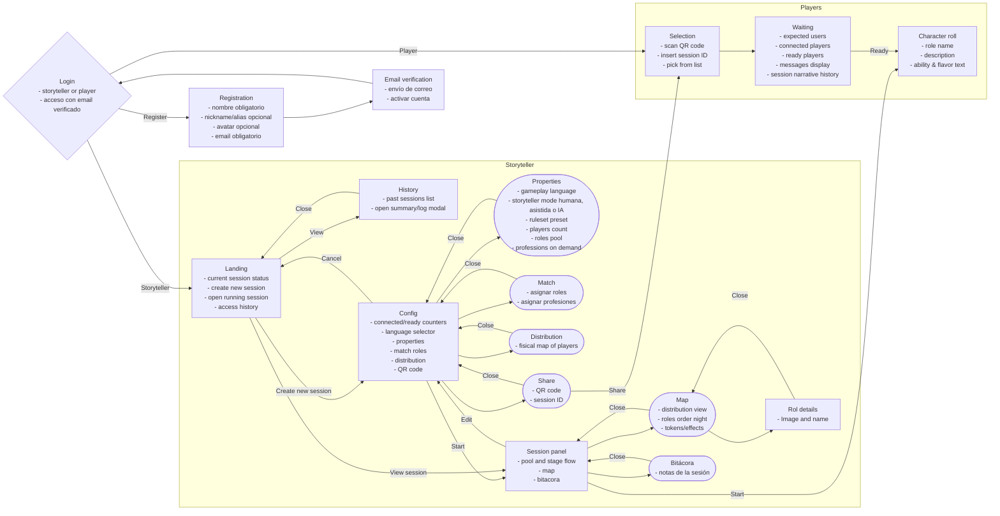
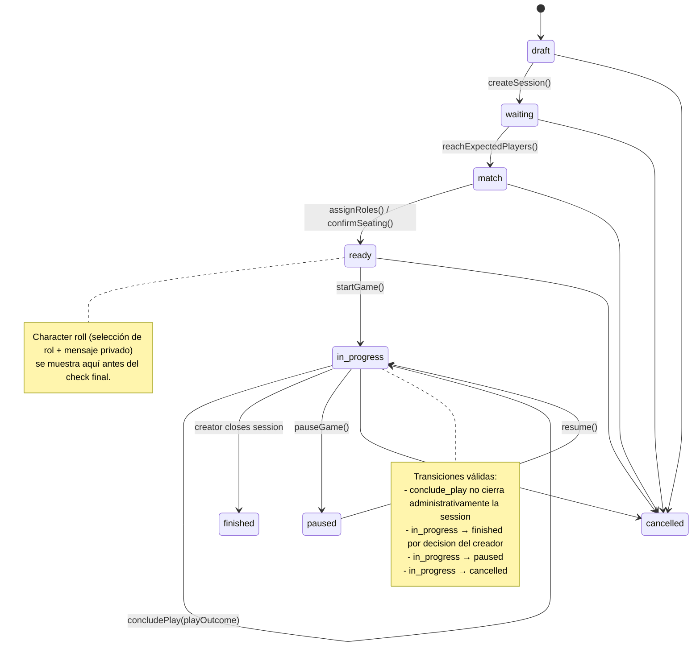
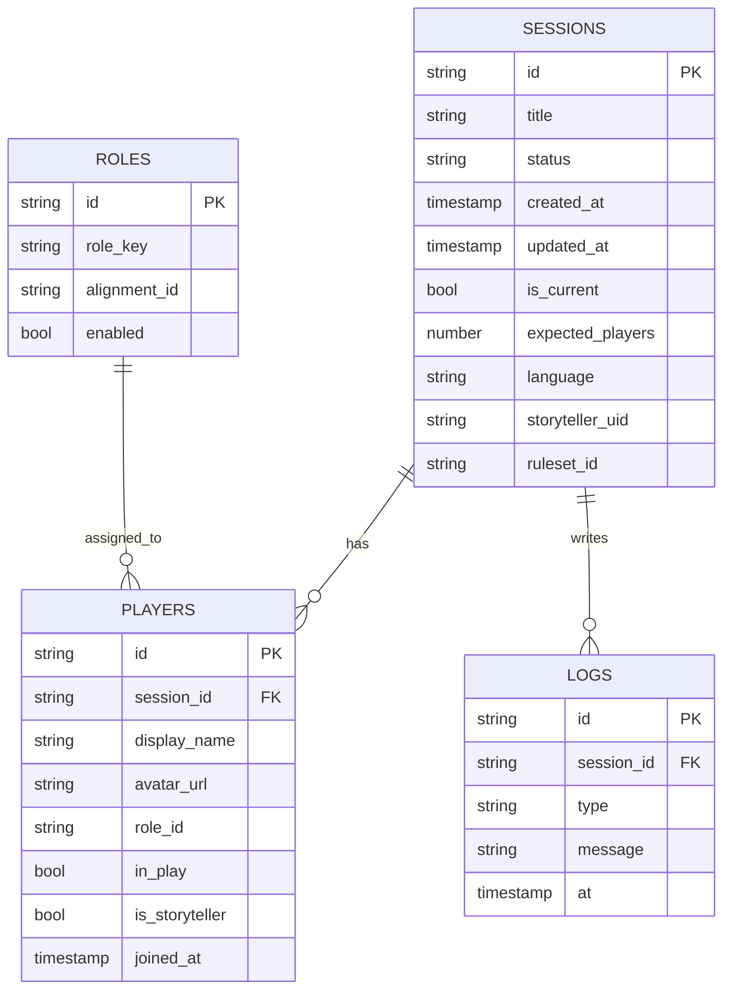

# Cyclic Social Engine - Arquitectura de aplicacion

> Documento de trabajo. Los diagramas Mermaid se renderizan en GitHub y en la vista previa de VS Code.

> El dominio vigente esta documentado en [`README.md`](./README.md) y
> [`domain_architecture.md`](./domain_architecture.md).

> [`historial_codex_resumen.md`](./historial_codex_resumen.md) y
> [`modelo_objetivo_sesion.md`](./modelo_objetivo_sesion.md) son archivo
> historico y no definen el motor actual.

> Decision tecnica: la extraccion del nucleo limpio esta descrita en [`decision_nucleo_limpio.md`](./decision_nucleo_limpio.md).

## 1) Flujo de pantallas (alto nivel)

## Comentarios y pendientes

- <!-- pendiente: --> Validar qué reglas específicas se controlan desde `Properties` (roles predefinidos vs. configuración ad-hoc) para modelarlo en la base de datos.
- <!-- pendiente: --> Definir si el flujo de `Selection` necesita mostrar sesiones previas abiertas por el mismo storyteller o sólo acepta QR/ID directo.
- <!-- pendiente: --> Confirmar si la pantalla `Character roll` debe persistir mensajes personalizados por jugador o si basta con derivarlos del catálogo de roles.
- <!-- nota: --> Los nombres visibles, textos e imagenes pertenecen a skin. El
  motor guarda `roleKey`, `alignmentId` y estado runtime.
