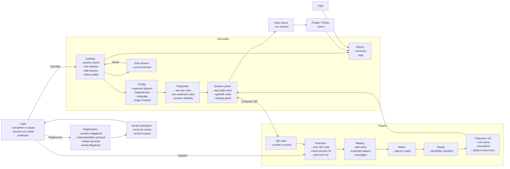
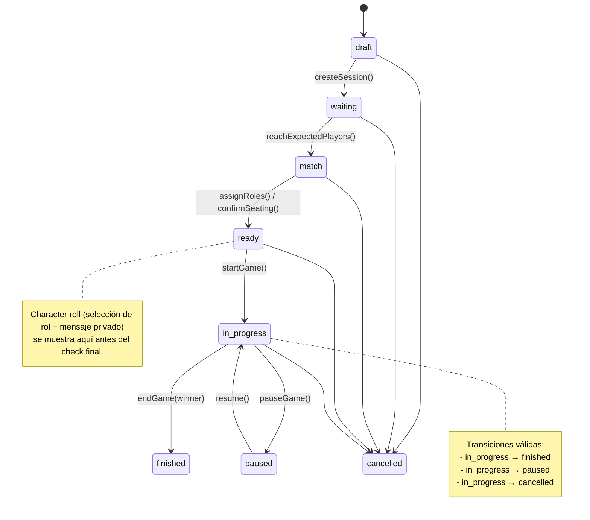
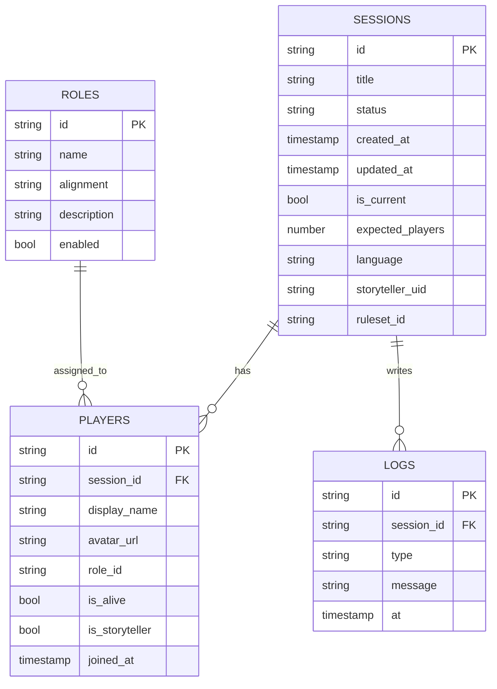

# Village Storyteller — Arquitectura (borrador vivo)

> Documento de trabajo. Los diagramas Mermaid se renderizan en GitHub y en la vista previa de VS Code.

## 1) Flujo de pantallas (alto nivel)

## Comentarios y pendientes

- <!-- pendiente: --> Validar qué reglas específicas se controlan desde `Properties` (roles predefinidos vs. configuración ad-hoc) para modelarlo en la base de datos.
- <!-- pendiente: --> Definir si el flujo de `Selection` necesita mostrar sesiones previas abiertas por el mismo storyteller o sólo acepta QR/ID directo.
- <!-- pendiente: --> Confirmar si la pantalla `Character roll` debe persistir mensajes personalizados por jugador o si basta con derivarlos del catálogo de roles.
- <!-- nota: --> `alignment` en roles se acota a `villager|wolf|neutral|special`; `type` en logs a `info|warn|error|action`.
