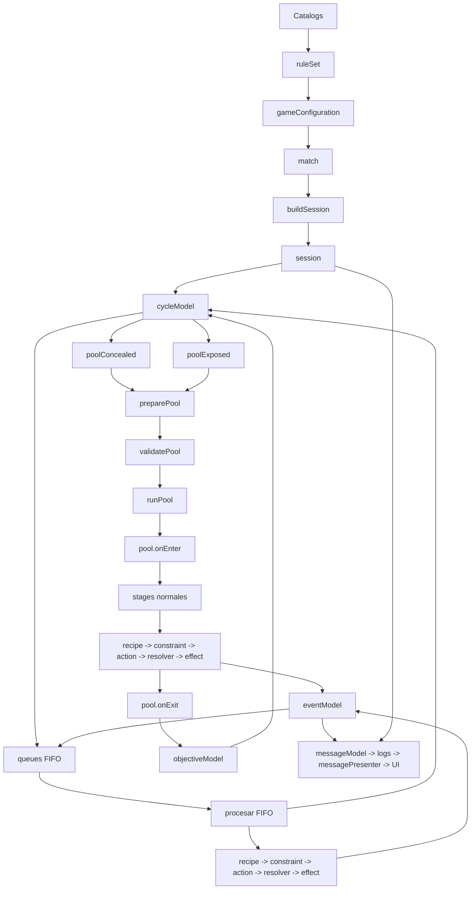

# Arquitectura del nuevo dominio

Este mapa contiene exclusivamente los elementos del nuevo dominio mecanico. No
representa la UI antigua, Firebase ni el flujo historico de `Session.svelte`.

Leyenda:

- Verde: implementado en `src/lib/domain`.
- Amarillo discontinuo: concepto acordado pendiente de migracion.
- Gris punteado: pendiente de definicion.

El PDF navegable esta en [domain_architecture.pdf](./domain_architecture.pdf).
La imagen inferior sirve como respaldo cuando el visor Markdown no soporta
Mermaid.


## Flujo principal



## Jerarquia aceptada

```text
session
└── cycle
    ├── entries
    ├── queues
    │   ├── queueBeforePoolConcealed
    │   ├── queueAfterPoolConcealed
    │   ├── queueBeforePoolExposed
    │   └── queueAfterPoolExposed
    └── pools
        ├── poolConcealed
        │   ├── pool.onEnter
        │   ├── stages
        │   └── pool.onExit
        └── poolExposed
            ├── pool.onEnter
            ├── stages
            └── pool.onExit
```

`cycle` entiende la relacion entre pools, queues e iteraciones. `entries` es el
cursor generico sobre `queueBeforePoolN -> poolN -> queueAfterPoolN`. Un pool
entiende solo de sus propios stages. Un stage coordina recipes, pero no mueve
otros pools ni queues.

## Estado materializado

- `session.cycle` administra la navegacion entre pools y queues.
- `session.cycle.queues` contiene colas FIFO independientes que `cycleModel`
  consulta por `queueKey`; no pasan por `preparePool` ni `validatePool`.
- Cada pool declara `surfacePhase` y sus queues asociadas heredan esa fase en
  `cycle.entries`.
- `session.currentStageSource` distingue si el cursor ejecuta un stage de pool
  o de la cola sin usar una bandera dentro del stage.
- `preparePool` y `validatePool` preparan exclusivamente pools normales.
- `startCycle` pertenece a `cycleModel`.
- `role.blockedPropertyChanges` sustituye los bloqueos booleanos antiguos.
