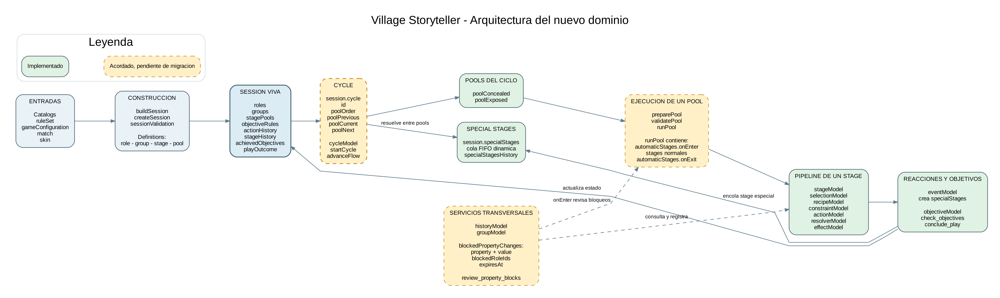
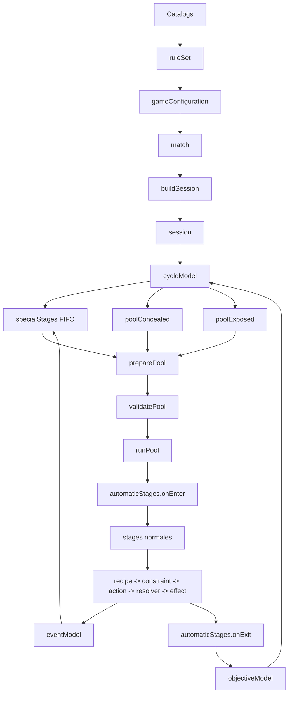

# Arquitectura del nuevo dominio

Este mapa contiene exclusivamente los elementos del nuevo dominio mecanico. No
representa la UI antigua, Firebase ni el flujo historico de `Session.svelte`.

Leyenda:

- Verde: implementado en `src/lib/domain`.
- Amarillo discontinuo: concepto acordado pendiente de migracion.
- Gris punteado: pendiente de definicion.

El PDF navegable esta en [domain_architecture.pdf](./domain_architecture.pdf).
La imagen inferior sirve como respaldo cuando el visor Markdown no soporta
Mermaid.



## Flujo principal



## Jerarquia aceptada

```text
session
└── cycle
    ├── coordina specialStages entre pools
    ├── poolConcealed
    └── poolExposed
        ├── automaticStages.onEnter
        ├── stages
        └── automaticStages.onExit
```

`cycle` entiende la relacion entre pools y sus iteraciones. Un pool entiende
solo de sus propios stages. Un stage coordina selection y recipes, pero no mueve
otros pools.

## Migracion pendiente

Los siguientes acuerdos todavia no estan materializados completamente:

1. Crear `session.cycle`.
2. Mover `poolCurrent`, `poolPrevious`, `poolNext` y `poolOrder` desde
   `stagePools` hacia `session.cycle`.
3. Mover la navegacion entre pools desde `poolCursorModel` hacia `cycleModel`.
4. Mantener `session.specialStages` como cola FIFO independiente que elimina
   cada stage completado.
5. Crear `preparePool`, `validatePool` y `runPool`.
6. Mover `start_cycle` desde action/recipe/effect hacia `cycleModel`.
7. Sustituir `blockedActions` por `blockedPropertyChanges`.
