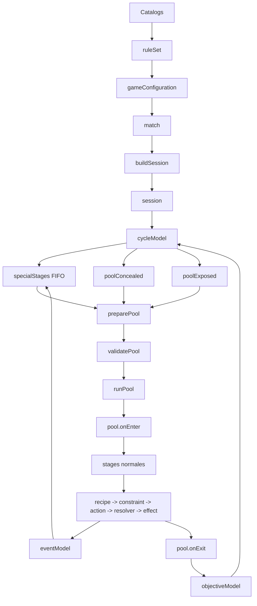

# Arquitectura del nuevo dominio

Este mapa contiene exclusivamente los elementos del nuevo dominio mecanico. No
representa la UI antigua, Firebase ni el flujo historico de `Session.svelte`.

Leyenda:

- Verde: implementado en `src/lib/domain`.
- Amarillo discontinuo: concepto acordado pendiente de migracion.
- Gris punteado: pendiente de definicion.

El PDF navegable esta en [domain_architecture.pdf](./domain_architecture.pdf).
La imagen inferior sirve como respaldo cuando el visor Markdown no soporta
Mermaid.


## Flujo principal



## Jerarquia aceptada

```text
session
└── cycle
    ├── coordina specialStages entre pools
    ├── poolConcealed
    └── poolExposed
        ├── pool.onEnter
        ├── stages
        └── pool.onExit
```

`cycle` entiende la relacion entre pools y sus iteraciones. Un pool entiende
solo de sus propios stages. Un stage coordina selection y recipes, pero no mueve
otros pools.

## Estado materializado

- `session.cycle` administra la navegacion entre pools.
- `session.specialStages` es una cola FIFO independiente.
- `preparePool` y `validatePool` preparan cada entrada.
- `startCycle` pertenece a `cycleModel`.
- `role.blockedPropertyChanges` sustituye los bloqueos booleanos antiguos.
