# Mapa visual del motor

Este documento muestra las partes del motor y donde validar cada cosa. La idea
es poder ubicar una regla nueva sin mezclar responsabilidades.

> Mapa integral actualizado: [domain_architecture.md](./domain_architecture.md).
> Incluye una imagen PNG de respaldo y una version PDF, por lo que no depende
> del soporte Mermaid del visor.


## Vista general

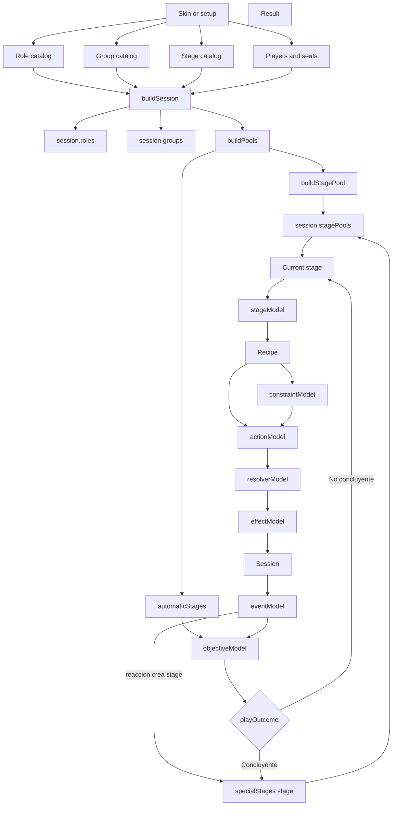

Lectura corta:

```text
skin/setup -> buildSession -> roles + groups + stagePools -> stage actual -> receta -> restricciones -> accion pura -> resolver -> aplicar efectos -> eventos/reacciones -> automaticStages -> check_objectives -> specialStages
```

## Capas del motor

| Capa | Archivo | Responsabilidad | No debe hacer |
|---|---|---|---|
| Sesion | `sessionModel.js` | Guardar vocabulario compartido y consultas basicas de sesion | Construir objetos o resolver reglas complejas |
| Definicion de sesion | `sessionDefinition.js` | Crear una sesion viva con players, roles, groups, pools e historiales | Resolver acciones |
| Definicion de player | `playerDefinition.js` | Crear players de sesion | Aplicar reglas sobre roles |
| Definicion de rol | `roleDefinition.js` | Crear roles y el estado de esos roles dentro de una sesion | Ejecutar acciones |
| Definicion de pool | `poolDefinition.js` | Crear pools y organizar stages dentro de pools configurables | Decidir que hace cada stage |
| Validacion de sesion | `sessionValidation.js` | Detectar datos rotos o incompletos | Corregir datos automaticamente |
| Historial | `historyModel.js` | Crear y consultar memoria mecanica de la sesion | Resolver acciones o cambiar estado por si mismo |
| Catalogo de roles | `roleCatalog.js` | Guardar roles mecanicos predefinidos | Vestir roles con nombres de skin |
| Definicion de grupo | `groupDefinition.js` | Crear grupos y resolver sus roleIds iniciales | Ejecutar acciones |
| Catalogo de grupos | `groupCatalog.js` | Guardar grupos mecanicos predefinidos | Confundir grupo con skin o alignment narrativa |
| Cursor de pools | `poolCursorModel.js` | Mover el cursor entre stages activos dentro de los pools | Ejecutar acciones de roles |
| Stages | `stageModel.js` | Elegir recetas del stage actual y cerrar el stage cuando proceda | Resolver reglas propias de cada receta |
| Constructor de stages | `stageDefinition.js` | Crear stages genericos desde key, actor, acciones, completion y metadata | Decidir el orden final de ejecucion |
| Catalogo de stages | `stageCatalog.js` | Guardar stages predefinidos reutilizables | Definir todas las combinaciones posibles de una skin |
| Catalogo de recetas | `recipeCatalog.js` | Definir recetas reutilizables del nucleo | Ejecutar recetas o leer la sesion |
| Recetas | `recipeModel.js` | Validar restricciones y convertir receta en accion pura | Aplicar efectos o avanzar stages |
| Restricciones | `constraintModel.js` | Validar restricciones propias de una receta | Cambiar estado directamente |
| Acciones | `actionModel.js` | Validar y resolver acciones puras | Evaluar restricciones de receta |
| Resolver | `resolverModel.js` | Decidir que efectos propuestos sobreviven, se bloquean o generan efectos derivados | Escribir cambios en sesion |
| Efectos | `effectModel.js` | Escribir efectos finales sobre la sesion | Decidir si un efecto debe existir |
| Eventos | `eventModel.js` | Convertir efectos finales en eventos y activar reacciones declaradas por roles | Ejecutar la receta del stage especial |
| Objectives | `objectiveModel.js` | Evaluar objetivos y playOutcome | Cerrar administrativamente la session |
| Seleccion | `selectionModel.js` | Contar elecciones y resolver chosen/empate | Aplicar el efecto de la seleccion |

## Construccion de sesion

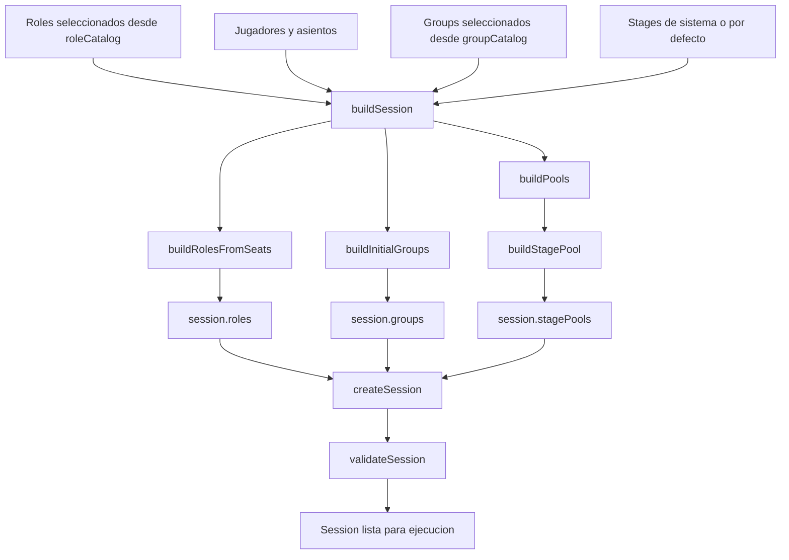

Regla de lectura:

```text
createX construye un objeto concreto.
buildX ensambla varias definiciones para preparar una sesion o parte de ella.
```

`role` no tiene archivo `roleDefinition.js`. Es el estado de un
role dentro de `session.roles`, construido desde `roleDefinition.js`.

`buildSession` valida por defecto la sesion ensamblada. Si la terna
role/player/seat no esta completa, devuelve `ok: false` con errores y conserva
la sesion construida para inspeccion.

## Flujo de un stage

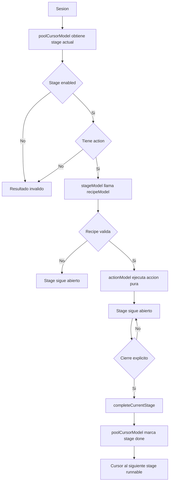

`stageModel.js` no sustituye a `poolCursorModel.js` ni a `actionModel.js`. Solo une
ambas piezas y separa ejecutar receta de cerrar stage.

Los IDs de stage son slots neutros, por ejemplo `stage_01`, `stage_02` o
`stage_03`. Quien actua se define en `actor`; la accion disponible dentro
del stage describe la mecanica. Si un stage ofrece varias acciones, el input debe
indicar `actionKey`.

## Flujo de una receta

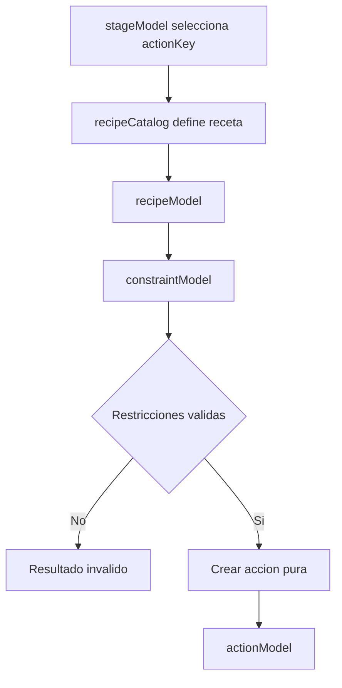

Ejemplo:

```text
receta restore_recent_out_of_play
  -> accion pura set_in_play(true)
  -> restriccion require_recent_set_property
```

`actionModel.js` no recibe la receta completa. Recibe la accion pura despues de
que `recipeModel.js` haya validado sus restricciones.

## Restricciones

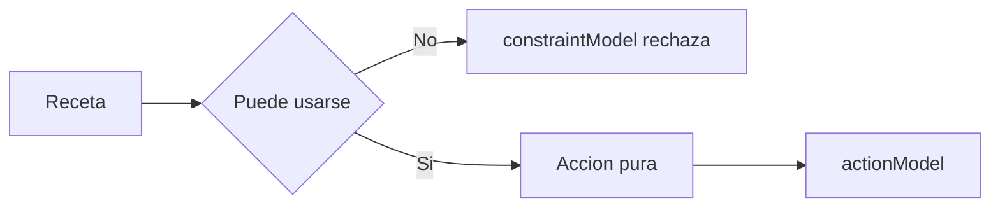

Lectura:

```text
restriccion = condicion de uso de una receta
```

Por eso `no_repeat_target`, `require_recent_set_property` y `limited_uses`
viven en `constraintModel.js`.

## Orden de ejecucion

El motor no usa el nombre del stage para decidir que va antes o despues.

```text
poolOrder -> orden entre pools
pools[poolKey] -> orden de stages dentro de ese pool
```

`session.specialStages` es una cola FIFO independiente de `pools`. Antes de
entrar en cualquier pool normal, el ciclo comprueba si contiene stages
pendientes y, si los tiene, los resuelve primero.

Ejemplo:

```js
createPool({
  poolOrder: ['poolConcealed', 'poolExposed'],
  pools: {
    poolConcealed: [
      { key: 'stage_03' }
    ],
    poolExposed: [
      { key: 'stage_05' }
    ]
  }
})

session.specialStages = [
  { key: 'stage_01' },
  { key: 'stage_02' }
]
```

Una skin puede cambiar ese orden declarando otro array. No hay pesos ni
prioridades implicitas por ahora; eso se anadira solo si aparece una regla real
que necesite reordenar stages dinamicamente.

## Cierre de stage

Resolver una receta y avanzar al siguiente stage son operaciones distintas.

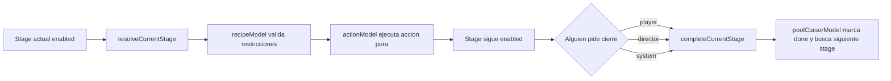

Lectura:

```text
resolveCurrentStage no marca done.
completeCurrentStage marca done y avanza.
```

El cierre queda registrado en `session.stageHistory` con `requestedBy`
para distinguir cierres pedidos por player, director o system.

Nota de diseno:

```text
poolDefinition.js preparara en el futuro arrays ordenados desde
definiciones de skin/flavor.
```

Ese modelo podra aceptar `order` en pools configurables como `poolExposed` y
`poolConcealed`. `poolCursorModel.js` seguira ejecutando arrays ya ordenados.

`specialStages` conserva siempre el orden FIFO de insercion.

## Flujo de una accion

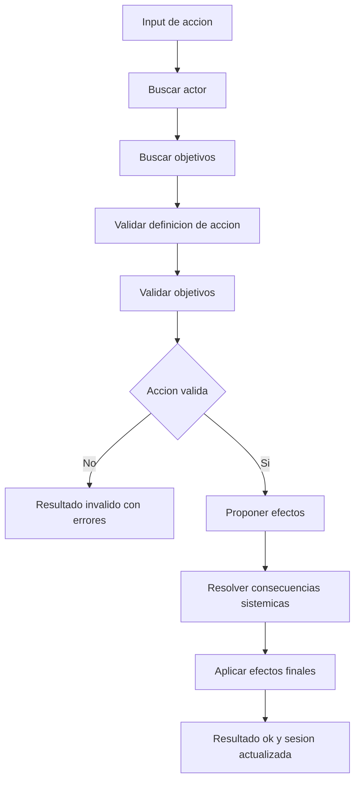

Ejemplo con `set_in_play`:

```text
input:
actorIds = [alignment_b_actor-0]
targetIds = [alignment_a_target-0]

validacion:
- existe el actor?
- existe el objetivo?
- el objetivo esta inPlay?
- cumple not_same_alignment?
- el objetivo tenia bloqueada esta accion?

efecto propuesto:
set_property target.inPlay = false

resolver:
- si target esta linked, derivar set_property linkedTarget.inPlay = false

aplicador:
- escribir inPlay=false en roles afectados
```

## Donde validar cada cosa

| Pregunta | Lugar correcto | Ejemplo |
|---|---|---|
| Existe la sesion y sus datos basicos son coherentes? | `sessionValidation.js` | IDs duplicados, grupo apunta a rol inexistente |
| Que ocurrio antes en esta partida? | `historyModel.js` | efectos aplicados en el ciclo actual |
| Este stage debe ejecutarse ahora? | `poolCursorModel.js` | saltar stages disabled |
| El stage actual tiene una receta ejecutable? | `stageModel.js` | stage enabled con `actions` definida |
| La receta puede usarse ahora? | `recipeModel.js` + `constraintModel.js` | `restore_recent_out_of_play` exige historial previo |
| La accion esta bien definida? | `actionModel.js` | `set_in_play` debe traer `property: inPlay` |
| El actor existe? | `actionModel.js` | `missing actor` |
| Los objetivos existen y cumplen filtros? | `actionModel.js` | `in_play`, `not_self`, `not_same_alignment`, `distinct` |
| Esta receta tiene una restriccion propia? | `constraintModel.js` | no repetir mismo objetivo en ciclos consecutivos |
| Una accion queda bloqueada? | `actionModel.js` | `block_action` bloquea `set_in_play(false)` contra un target |
| Un efecto genera consecuencias globales? | `resolverModel.js` | `linked` propaga `inPlay=false` |
| Como se escribe un cambio final? | `effectModel.js` | `set_property`, `set_group` |
| La parte jugable ha concluido? | `objectiveModel.js` | `holder_reaches_in_play_parity`, `only_holder_group_remains_in_play`, `no_roles_in_play` |

## Flujo de efectos

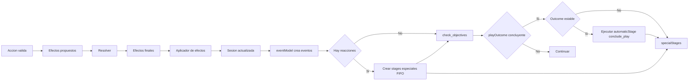

Regla importante:

```text
Una accion no deberia escribir directamente cualquier cosa en la sesion.
Debe proponer efectos, resolverlos y aplicar solo efectos finales.
```

Regla de `specialStages`:

```text
Los eventos especiales se registran como stages pendientes en specialStages. Si
check_objectives emite un playOutcome concluyente, primero se comprueba si algun
stage pendiente puede alterar ese outcome. conclude_play se ejecuta como
automaticStage final cuando el outcome es estable.
```

Excepcion actual:

```text
block_action guarda flags temporales directamente porque su funcion es marcar
un bloqueo del ciclo actual. Si crece en complejidad, podria pasar tambien
por una ruta de efectos mas estricta.
```

## Resolver vs Effect Model

Estas dos capas pueden parecer parecidas, pero su pregunta central es distinta.

### `resolverModel.js`

Pregunta:

```text
dados estos efectos propuestos, cuales deben llegar a ser efectos finales?
```

Ejemplos:

- Si se propone `set_property inPlay=false` sobre un rol linked, derivar otro
  `set_property inPlay=false` sobre sus miembros de grupo.
- Si en el futuro un efecto queda neutralizado por otra regla, marcarlo como
  bloqueado.
- Si un efecto produce consecuencias encadenadas, generar esas consecuencias.

El resolver no escribe en la sesion. Solo decide la lista final:

```text
proposedEffects -> finalEffects + blockedEffects
```

### `effectModel.js`

Pregunta:

```text
como se escribe este efecto final en la sesion?
```

Ejemplos:

- `set_property`: cambiar `role.inPlay`.
- `set_group`: crear o actualizar un grupo mecanico, por ejemplo `linked`.
- `start_cycle`: limpiar flags temporales y preparar el nuevo ciclo.

El aplicador de efectos no decide si el cambio es justo, valido o narrativamente
correcto. Si recibe un efecto final valido, lo escribe.

Resumen:

```text
resolverModel decide consecuencias.
effectModel aplica cambios.
```

## Flujo de grupos linked

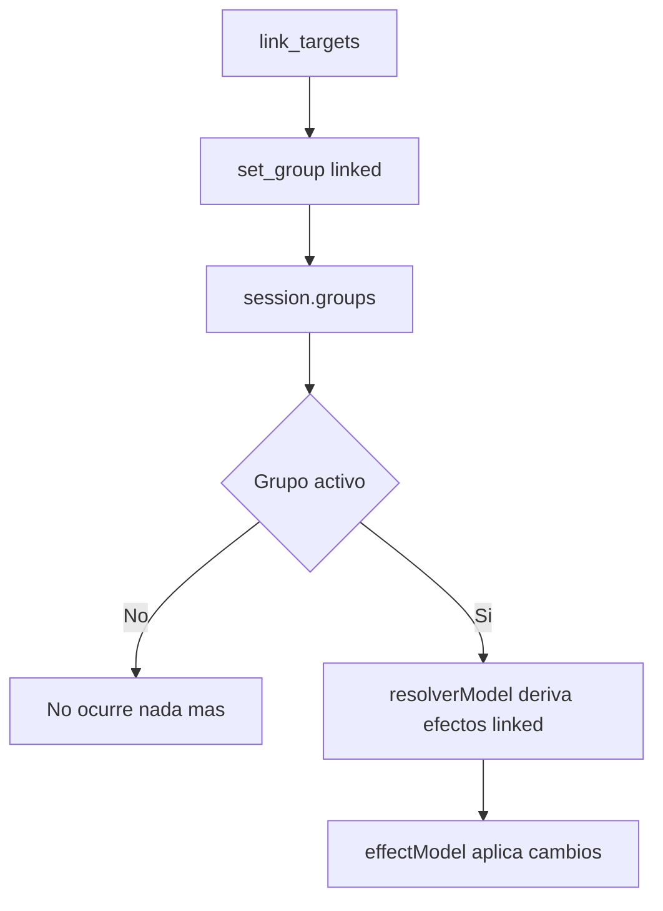

Lectura:

```text
link_targets no elimina a nadie.
link_targets solo crea un grupo.
El group linked tiene consecuencias cuando otro efecto lo activa.
```

## Flujo de objectives

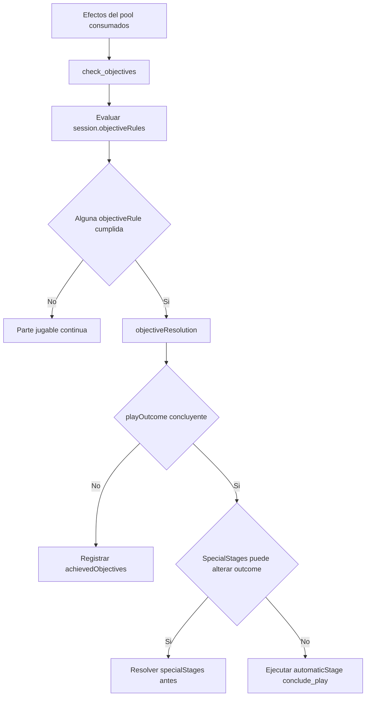

Orden objetivo:

1. Evaluar `session.objectiveRules`.
2. Registrar `achievedObjectives` no concluyentes.
3. Resolver conflictos entre objectives concluyentes.
4. Emitir `playOutcome` si la parte jugable queda concluida.
5. Cruzar `objectiveRule.dependencies` con `stage.influences` de stages
   pendientes en `specialStages`.
6. Ejecutar `conclude_play` como automaticStage final si hay `playOutcome`
   concluyente y estable.

Regla importante:

```text
check_objectives se ejecuta al final de cada pool, no despues de cada stage
normal, porque stages posteriores del mismo pool pueden modificar el resultado
de stages anteriores.
```

Flujo actual de comprobacion de objetivos:

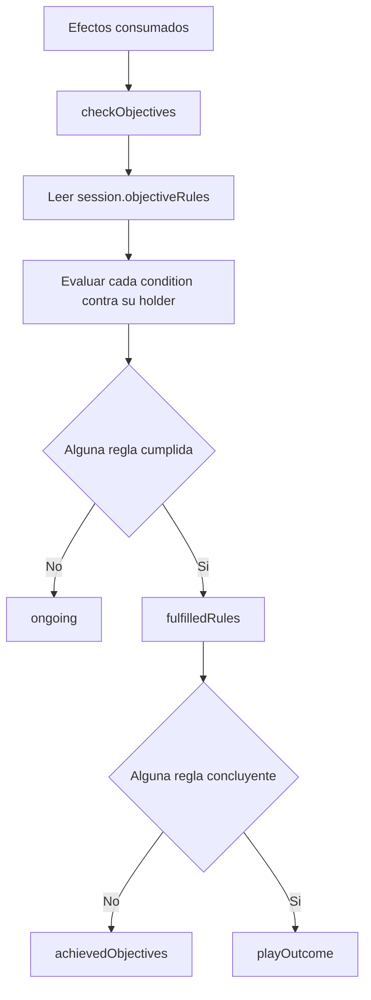

Orden actual:

1. Leer `session.objectiveRules`.
2. Resolver el `holder` de cada regla.
3. Evaluar la `condition`.
4. Devolver `fulfilledRules`.
5. Emitir `achievedObjectives` o `playOutcome` segun `onFulfilled`.

`objectiveModel` no crea reglas implicitas de alignment o linked. Si un
alignment o group linked necesita objective, primero debe existir un group
holder que represente ese sujeto.

## Pipeline recomendado para nuevas mecanicas

Cuando aparezca una mecanica nueva, seguir este orden:

1. Nombrar la mecanica de forma abstracta.
2. Decidir si es accion, modificador, efecto, grupo, consecuencia u objective.
3. Escribir un ejemplo minimo de datos.
4. Implementar la pieza mas pequena posible.
5. Anadir un test real en `src/lib/domain/__test__/domain.test.js`.
6. Anadir una demo si ayuda a verla con ojos humanos.
7. Actualizar `docs/mechanics_inventory.md`.

## Ejemplos de clasificacion

| Regla humana | Clasificacion abstracta | Lugar probable |
|---|---|---|
| La Vidente mira una carta | accion `inspect_role` | `actionModel.js` |
| El Protector protege antes del ataque | accion `block_action` | `actionModel.js` |
| No puede bloquear al mismo objetivo dos ciclos seguidos | restriccion `no_repeat_target` | `constraintModel.js` |
| Cupido enlaza dos jugadores | accion `link_targets` + group linked futuro | `groupModel.js` |
| Si un linked sale de juego, el otro tambien | consecuencia sistemica | `resolverModel.js` |
| Si solo quedan linked de alignments distintos, cumplen objective especial | objectiveRule sobre group linked | `session.objectiveRules` |
| Un group de alignment alcanza al resto | `holder_reaches_in_play_parity` | `session.objectiveRules` |
| Un jugador no puede elegir contra su linked | restriccion de seleccion | `stage.selectionRules.groupRestrictions` |

## Modelo de seleccion

Una seleccion generica no debe significar automaticamente "dejar fuera de juego".
Debe entenderse como una seleccion colectiva:

```text
selecciones -> recuento -> target chosen / empate / nulo
```

Despues otra capa decide que accion se aplica al target chosen.

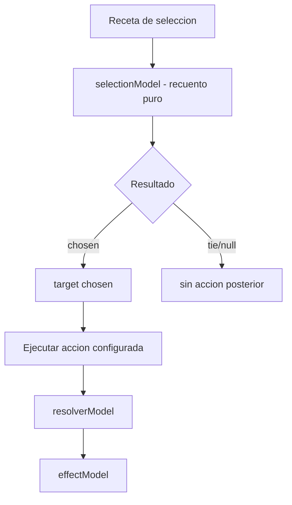

### Estrategias de implementacion

| Estrategia | Idea | Ventaja | Riesgo |
|---|---|---|---|
| Mantener acciones concretas | una receta distinta por cada seleccion | Simple para pocos casos | Duplica logica de seleccion cuando aparezcan mas selecciones |
| Stage con selectionRules recomendado | `select` resuelve target y `stageModel` ejecuta la receta declarada | Flexible y anonimo | Requiere que el stage declare claramente sus reglas de seleccion |
| Efecto directo desde seleccion | El seleccion devuelve directamente `set_property` u otro efecto | Rapido de implementar | Mezcla recuento con consecuencias y empobrece la reutilizacion |

La estrategia recomendada es la segunda:

```text
stage = selectionRules + recipes
```

Ejemplo conceptual:

```js
{
  key: 'stage_05',
  selectionRules: {
    required: 'all_selectors',
    abstain: 'not_allowed',
    unanimous: 'not_required',
    tie: 'null_on_tie',
    runoff: 'tied_candidates',
    nullResult: 'end_as_null',
    repeatLimit: 1,
    abstainResolution: {
      type: 'ignore'
    },
    supportThreshold: {
      type: 'none',
      base: 'cast_selections'
    },
    candidateIds: null,
    groupRestrictions: [
      {
        type: 'exclude_group_member_target',
        groupType: 'linked'
      }
    ]
  },
  actions: [
    {
      key: 'set_out_of_play',
      id: 'set_in_play',
      effect: {
        type: 'set_property',
        targetType: 'role',
        property: 'inPlay',
        value: false
      }
    }
  ]
}
```

Lectura:

```text
selectionModel solo dice que roleId ha sido chosen.
stageModel convierte chosenId en targetIds.
recipeModel/actionModel aplican la receta configurada sobre ese target.
```

Ejemplos futuros con la misma estructura:

- `set_property inPlay=false`
- `set_property hasMarker=true`
- `set_group`
- cualquier otro efecto permitido por el motor

La restriccion de `linked` no aplica a cualquier seleccion. Aplica a los stages que
la declaren en `selectionRules.groupRestrictions`. En el caso actual:

```text
group_selection + set_out_of_play
```

Si una regla permite repetir la seleccion del ciclo con el mismo proposito, la
restriccion sigue aplicando porque el caracter mecanico de la seleccion no ha
cambiado.

## Selection Model

`selectionModel.js` modela la parte de recuento:

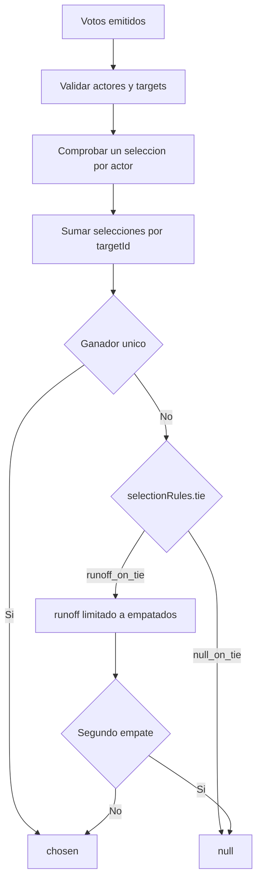

Implementacion actual:

```text
group_selection = selectionRules + set_out_of_play
```

Reglas actuales de esa seleccion:

```text
selectionRules.required: all_selectors
selectionRules.tie: null_on_tie
selectionRules.runoff: tied_candidates
selectionRules.nullResult: end_as_null
selectionRules.repeatLimit: 1
selectionRules.abstainResolution: ignore
selectionRules.supportThreshold: none
selectionRules.candidateIds: null -> todos los roles inPlay
groupRestrictions: exclude_group_member_target linked
```

La deuda tecnica anterior era mezclar recuento de seleccion y consecuencia en una
receta compuesta. Eso ya queda separado:

```text
selectionModel cuenta selecciones.
stageModel aplica la receta declarada si hay chosen.
actionModel resuelve la accion pura configurada.
```

Flujo actual de `group_selection + set_out_of_play`:

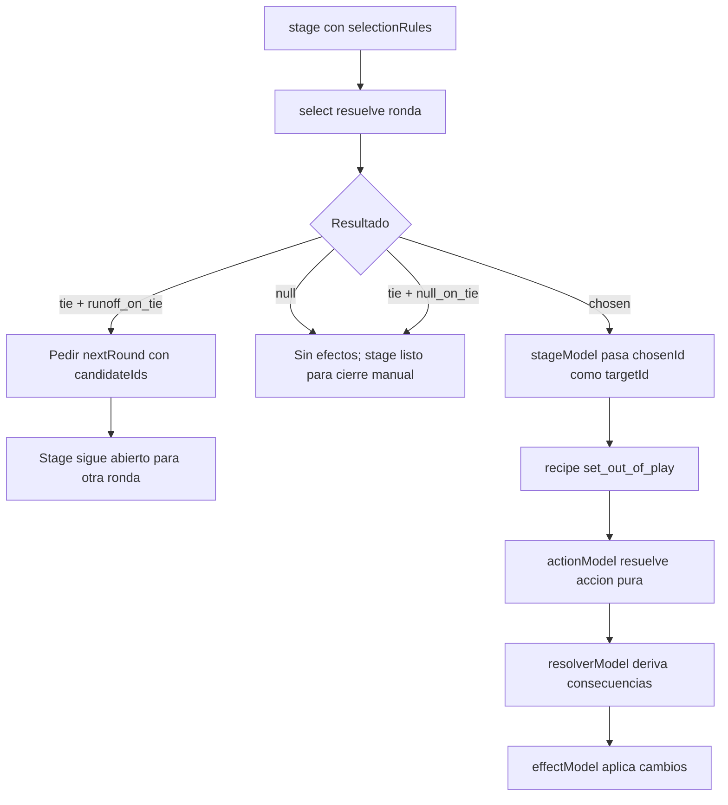

Contrato del stage con seleccion:

```text
chosen:
  - selectionModel devuelve chosenId.
  - stageModel ejecuta la receta del stage usando chosenId como targetIds.

null:
  - No se ejecuta receta.
  - No se generan efectos.
  - El stage queda abierto, pero listo para que player/director/system lo cierre
    con completeCurrentStage segun sus reglas de completion.

tie:
  - Si selectionRules.tie no define otra cosa, se trata como null.
  - Si selectionRules.tie = runoff_on_tie, selectionModel devuelve nextRound con
    candidateIds definido por selectionRules.runoff.
  - La receta no se ejecuta hasta que una ronda posterior produzca chosen.
```

Reglas de seleccion ya previstas:

```text
candidateIds:
  - Lista de roleIds que pueden recibir selecciones en una ronda.
  - Si no se define, los candidatos por defecto son todos los roles inPlay.
  - En una segunda ronda puede cambiar, por ejemplo limitandose a los roleIds
    que recibieron selecciones o a los roleIds empatados.

runoff:
  - tied_candidates: segunda ronda solo entre los roleIds empatados.
  - selected_candidates: segunda ronda entre todos los roleIds que recibieron
    al menos un seleccion.
  - same_candidates: segunda ronda con los mismos candidatos de la ronda actual.

nullResult:
  - end_as_null: la seleccion nula no pide otra ronda.
  - repeat_on_null: la seleccion nula puede pedir otra ronda si repeatLimit lo
    permite.

repeatLimit:
  - Numero maximo de rondas adicionales que puede pedir selectionModel.
  - Por defecto es 1: una seleccion inicial puede pedir una segunda ronda, pero
    si esa segunda ronda vuelve a empatar o quedar nula, termina como null.

supportThreshold:
  - Minimo de selecciones necesarios para aceptar el chosen provisional.
  - none: acepta el chosen provisional sin exigir minimo adicional.
  - majority: exige mitad + 1.
  - fraction: exige una fraccion, por ejemplo 2/3.
  - base cast_selections: calcula el minimo sobre selecciones emitidas no abstenidos.
  - base selector_count: calcula el minimo sobre los actores obligados o definidos
    para el stage.
  - Si no alcanza el minimo, el resultado pasa a null con reason
    insufficient_support y la receta no se ejecuta.

abstainResolution:
  - ignore: las abstenciones no entran en el recuento de chosen.
  - null_if_highest: si la abstencion tiene mas selecciones que cualquier targetId,
    la seleccion queda null con reason abstention_highest.
  - Si la abstencion empata con el target mas votado, esta regla no actua por
    ahora; queda espacio para definir nuevos tipos mas adelante.
```

## Regla de orientacion

Si una regla responde a:

```text
puedo intentar hacer esto?
```

probablemente pertenece a `actionModel.js` o `constraintModel.js`.

Si responde a:

```text
que consecuencias tiene este efecto aceptado?
```

probablemente pertenece a `resolverModel.js`.

Si responde a:

```text
como se escribe este cambio?
```

probablemente pertenece a `effectModel.js`.

Si responde a:

```text
se ha cumplido un objetivo concluyente?
```

probablemente pertenece a `objectiveModel.js`.
