# Mapa visual del motor

Este documento muestra las partes del motor y donde validar cada cosa. La idea
es poder ubicar una regla nueva sin mezclar responsabilidades.

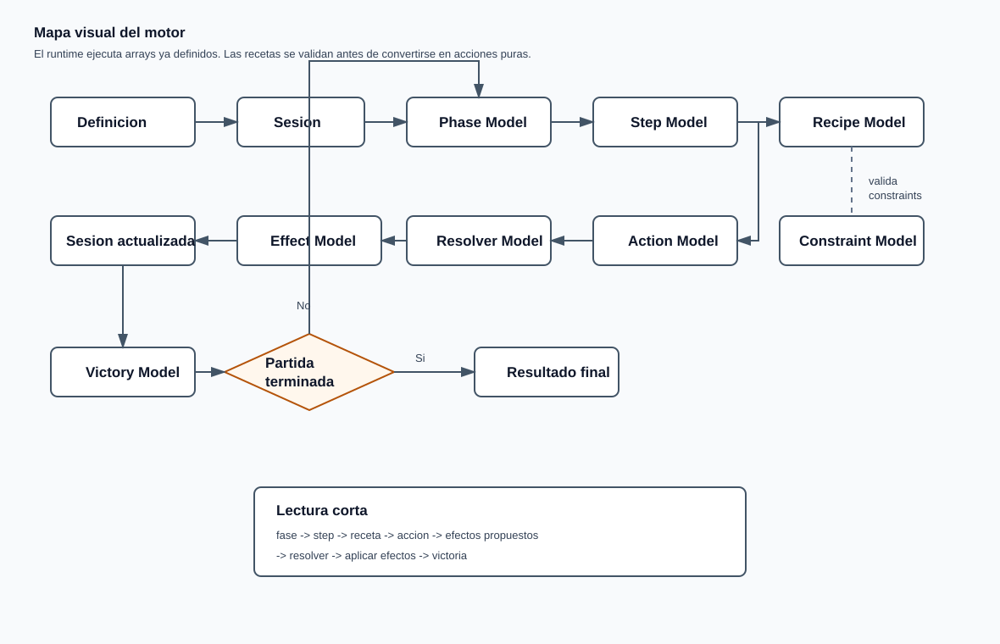

Nota: el diagrama superior es un SVG local para que se vea incluso si el visor
de Markdown no renderiza bloques Mermaid.

## Vista general

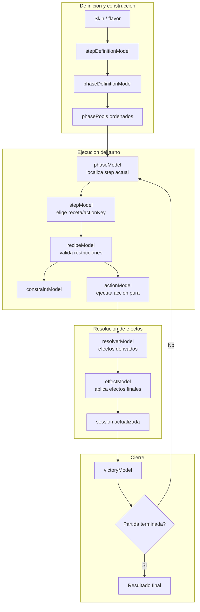

Lectura corta:

```text
skin -> steps ordenados -> step actual -> receta -> restricciones -> accion pura -> resolver -> aplicar efectos -> victoria
```

## Capas del motor

| Capa | Archivo | Responsabilidad | No debe hacer |
|---|---|---|---|
| Sesion | `sessionModel.js` | Crear datos coherentes: jugadores, roles, relaciones, fases | Resolver reglas complejas |
| Validacion de sesion | `sessionValidation.js` | Detectar datos rotos o incompletos | Corregir datos automaticamente |
| Historial | `historyModel.js` | Crear y consultar memoria mecanica de la sesion | Resolver acciones o cambiar estado por si mismo |
| Fases | `phaseModel.js` | Mover el cursor entre fases activas | Ejecutar acciones de roles |
| Steps | `stepModel.js` | Elegir la receta del step actual y avanzar cursor si termina bien | Resolver reglas propias de cada receta |
| Recetas | `recipeModel.js` | Validar restricciones y convertir receta en accion pura | Aplicar efectos o avanzar fases |
| Restricciones | `constraintModel.js` | Validar restricciones propias de una receta | Cambiar estado directamente |
| Modificadores | `modifierModel.js` | Reservado para futuras reglas que alteren parametros o resultados | Validar restricciones de receta |
| Acciones | `actionModel.js` | Validar y resolver acciones puras | Evaluar restricciones de receta |
| Resolver | `resolverModel.js` | Decidir que efectos propuestos sobreviven, se bloquean o generan efectos derivados | Escribir cambios en sesion |
| Efectos | `effectModel.js` | Escribir efectos finales sobre la sesion | Decidir si un efecto debe existir |
| Victoria | `victoryModel.js` | Evaluar si la partida termina | Modificar la sesion |
| Voto | `voteModel.js` | Contar elecciones y resolver ganador/empate | Aplicar el efecto de la votacion |

## Flujo de un step

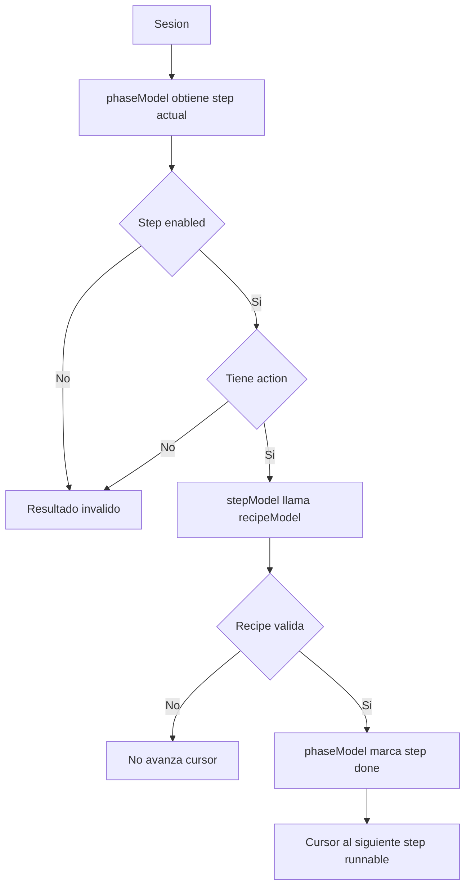

`stepModel.js` no sustituye a `phaseModel.js` ni a `actionModel.js`. Solo une
ambas piezas.

Los IDs de step son slots neutros, por ejemplo `step_01`, `step_02` o
`step_03`. Quien actua se define en `actorScope`; la accion disponible dentro
del step describe la mecanica. Si un step ofrece varias acciones, el input debe
indicar `actionKey`.

## Flujo de una receta

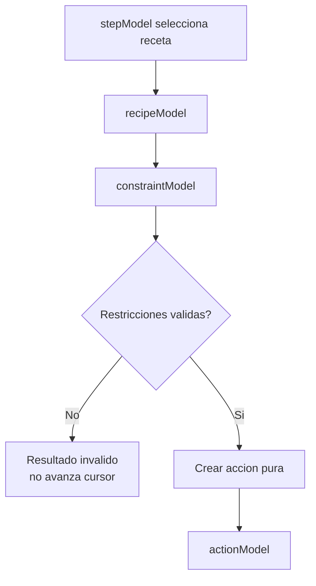

Ejemplo:

```text
receta restore_recent_out_of_play
  -> accion pura set_in_play(true)
  -> restriccion require_recent_set_property
```

`actionModel.js` no recibe la receta completa. Recibe la accion pura despues de
que `recipeModel.js` haya validado sus restricciones.

## Restricciones vs modificadores

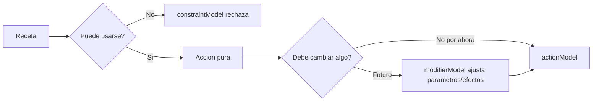

Lectura:

```text
restriccion = condicion de uso
modifier = transformacion futura de parametros, efectos o resultados
```

Por eso `prevent_repeat_target`, `require_recent_set_property` y `limited_uses`
viven en `constraintModel.js`. `modifierModel.js` queda como fachada compatible
y como sitio reservado para modificadores reales.

## Orden de ejecucion

El motor no usa el nombre del step para decidir que va antes o despues.

```text
poolOrder -> orden entre pools
pools[poolKey] -> orden de steps dentro de ese pool
```

Ejemplo:

```js
createPhasePools({
  poolOrder: ['poolFirstNight', 'poolEachDay'],
  pools: {
    poolFirstNight: [
      { key: 'step_01' },
      { key: 'step_02' }
    ],
    poolEachDay: [
      { key: 'step_05' }
    ]
  }
})
```

Una skin puede cambiar ese orden declarando otro array. No hay pesos ni
prioridades implicitas por ahora; eso se anadira solo si aparece una regla real
que necesite reordenar steps dinamicamente.

Nota de diseno:

```text
phaseDefinitionModel.js preparara en el futuro arrays ordenados desde
definiciones de skin/flavor.
```

Ese modelo podra aceptar `order` en pools configurables como `poolEachDay` y
`poolEachNight`. `phaseModel.js` seguira ejecutando arrays ya ordenados.

`poolSpecialEvents` no debe reordenarse por skin/flavor.

## Flujo de una accion

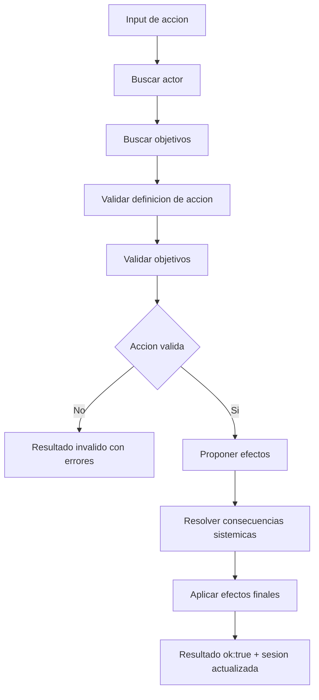

Ejemplo con `set_in_play`:

```text
input:
actorRoleInstanceId = faction_b_actor-0
targetRoleInstanceIds = [faction_a_target-0]

validacion:
- existe el actor?
- existe el objetivo?
- el objetivo esta inPlay?
- cumple not_same_faction?
- el objetivo tenia bloqueada esta accion?

efecto propuesto:
set_property target.inPlay = false

resolver:
- si target esta linked, derivar set_property linkedTarget.inPlay = false

aplicador:
- escribir inPlay=false en roleInstances afectados
```

## Donde validar cada cosa

| Pregunta | Lugar correcto | Ejemplo |
|---|---|---|
| Existe la sesion y sus datos basicos son coherentes? | `sessionValidation.js` | IDs duplicados, relacion apunta a rol inexistente |
| Que ocurrio antes en esta partida? | `historyModel.js` | efectos aplicados en el ciclo actual |
| Esta fase debe ejecutarse ahora? | `phaseModel.js` | saltar fases disabled |
| El step actual tiene una receta ejecutable? | `stepModel.js` | step enabled con `actions` definida |
| La receta puede usarse ahora? | `recipeModel.js` + `constraintModel.js` | `restore_recent_out_of_play` exige historial previo |
| La accion esta bien definida? | `actionModel.js` | `set_in_play` debe traer `property: inPlay` |
| El actor existe? | `actionModel.js` | `missing actor` |
| Los objetivos existen y cumplen filtros? | `actionModel.js` | `in_play`, `not_self`, `not_same_faction`, `distinct` |
| Esta receta tiene una restriccion propia? | `constraintModel.js` | no repetir mismo objetivo en ciclos consecutivos |
| Una accion queda bloqueada? | `actionModel.js` | `block_action` bloquea `set_in_play(false)` contra un target |
| Un efecto genera consecuencias globales? | `resolverModel.js` | `linked` propaga `inPlay=false` |
| Como se escribe un cambio final? | `effectModel.js` | `set_property`, `set_relation` |
| La partida ha terminado? | `victoryModel.js` | `at_least_remaining`, `single_faction`, `linked_exclusive_survivors` |

## Flujo de efectos

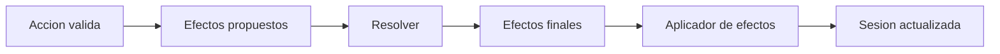

Regla importante:

```text
Una accion no deberia escribir directamente cualquier cosa en la sesion.
Debe proponer efectos, resolverlos y aplicar solo efectos finales.
```

Excepcion actual:

```text
block_action guarda flags temporales directamente porque su funcion es marcar
un bloqueo del ciclo actual. Si crece en complejidad, podria pasar tambien
por una ruta de efectos mas estricta.
```

## Resolver vs Effect Model

Estas dos capas pueden parecer parecidas, pero su pregunta central es distinta.

### `resolverModel.js`

Pregunta:

```text
dados estos efectos propuestos, cuales deben llegar a ser efectos finales?
```

Ejemplos:

- Si se propone `set_property inPlay=false` sobre un rol linked, derivar otro
  `set_property inPlay=false` sobre sus relacionados.
- Si en el futuro un efecto queda neutralizado por otra regla, marcarlo como
  bloqueado.
- Si un efecto produce consecuencias encadenadas, generar esas consecuencias.

El resolver no escribe en la sesion. Solo decide la lista final:

```text
proposedEffects -> finalEffects + blockedEffects
```

### `effectModel.js`

Pregunta:

```text
como se escribe este efecto final en la sesion?
```

Ejemplos:

- `set_property`: cambiar `roleInstance.inPlay`.
- `set_relation`: crear una entrada en `session.relations`.
- `resolve_pending_effects`: limpiar flags temporales y avanzar ciclo.

El aplicador de efectos no decide si el cambio es justo, valido o narrativamente
correcto. Si recibe un efecto final valido, lo escribe.

Resumen:

```text
resolverModel decide consecuencias.
effectModel aplica cambios.
```

## Flujo de relaciones

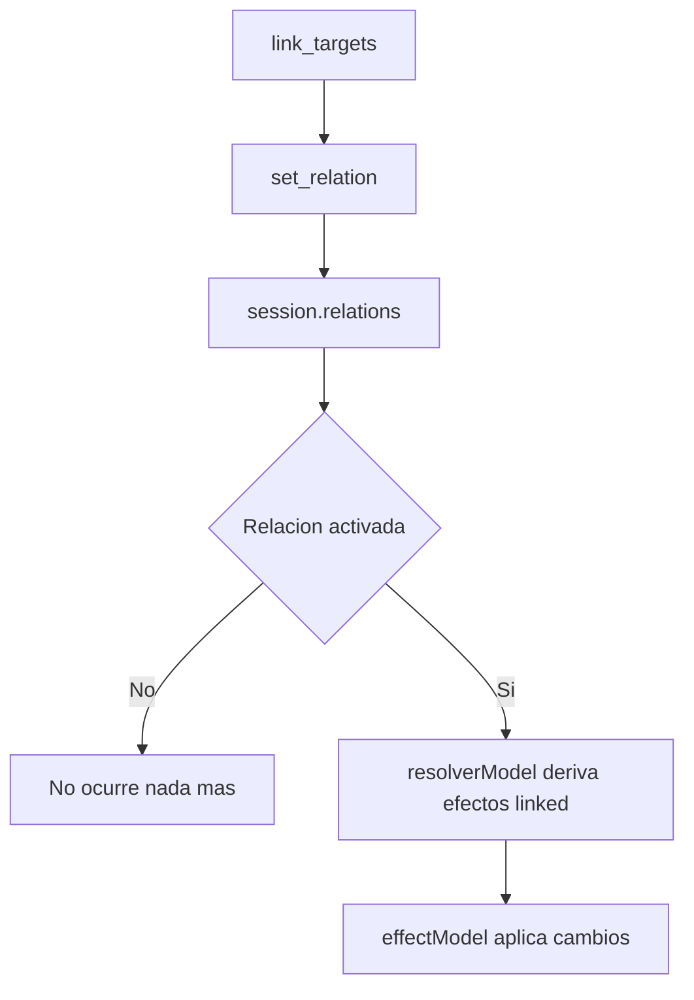

Lectura:

```text
link_targets no elimina a nadie.
link_targets solo crea una relacion.
La relacion linked tiene consecuencias cuando otro efecto la activa.
```

## Flujo de victoria

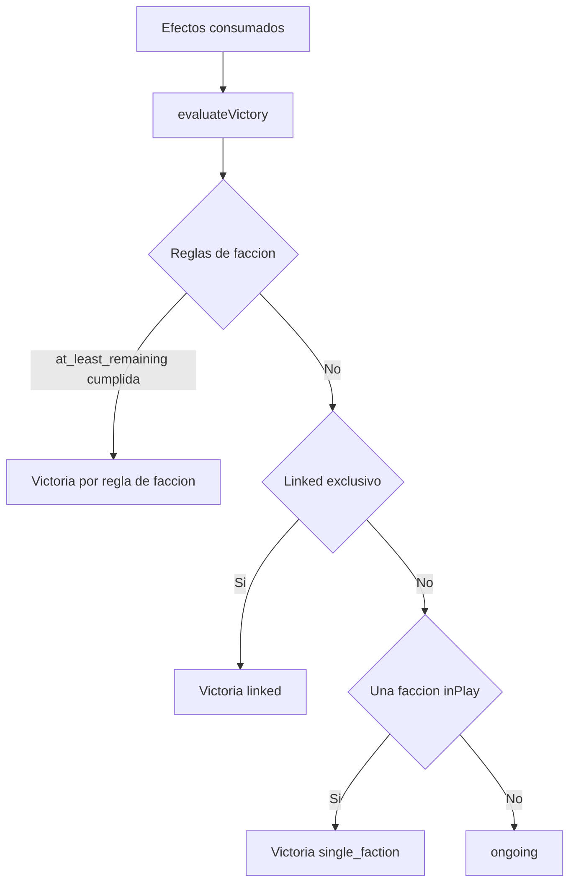

Orden actual:

1. Reglas configuradas de faccion.
2. Victoria especial por `linked`.
3. Victoria por unica faccion restante.
4. Partida en curso.

## Pipeline recomendado para nuevas mecanicas

Cuando aparezca una mecanica nueva, seguir este orden:

1. Nombrar la mecanica de forma abstracta.
2. Decidir si es accion, modificador, efecto, relacion, consecuencia o victoria.
3. Escribir un ejemplo minimo de datos.
4. Implementar la pieza mas pequena posible.
5. Anadir un test real en `src/lib/domain/__test__/domain.test.js`.
6. Anadir una demo si ayuda a verla con ojos humanos.
7. Actualizar `docs/mechanics_inventory.md`.

## Ejemplos de clasificacion

| Regla humana | Clasificacion abstracta | Lugar probable |
|---|---|---|
| La Vidente mira una carta | accion `inspect_role` | `actionModel.js` |
| El Protector protege antes del ataque | accion `block_action` | `actionModel.js` |
| No puede bloquear al mismo objetivo dos ciclos seguidos | restriccion `prevent_repeat_target` | `constraintModel.js` |
| Cupido enlaza dos jugadores | accion `link_targets` + efecto `set_relation` | `actionModel.js` + `effectModel.js` |
| Si un linked sale de juego, el otro tambien | consecuencia sistemica | `resolverModel.js` |
| Si solo quedan linked de facciones distintas, ganan | victoria especial | `victoryModel.js` |
| Una faccion gana si alcanza al resto | regla de faccion `at_least_remaining` | `victoryModel.js` |
| Un jugador no puede votar contra su linked | restriccion de voto | `vote_out_of_play` + `relationRestrictions` |

## Modelo de voto

Una votacion generica no debe significar automaticamente "dejar fuera de juego".
Debe entenderse como una seleccion colectiva:

```text
votos -> recuento -> target ganador / empate / nulo
```

Despues otra capa decide que accion se aplica al target ganador.

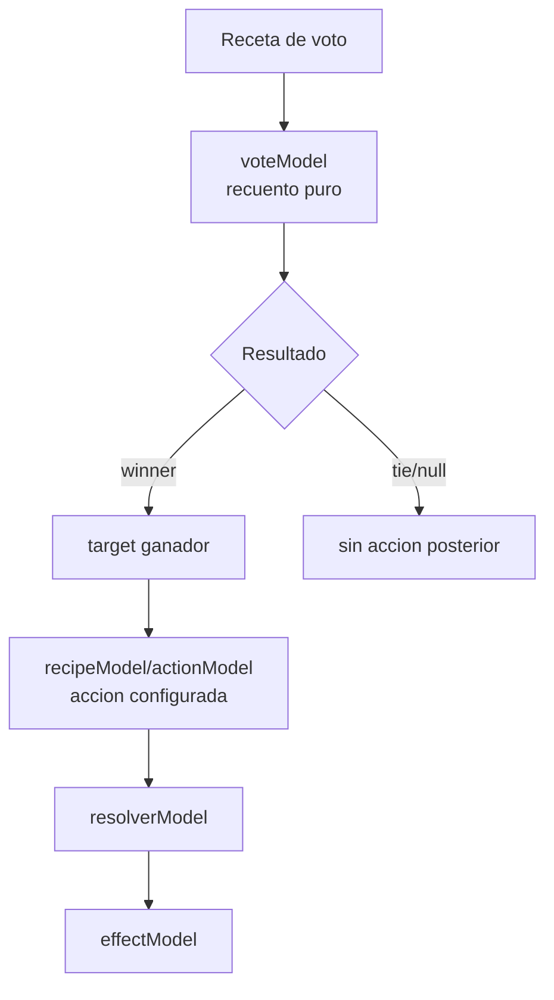

### Estrategias de implementacion

| Estrategia | Idea | Ventaja | Riesgo |
|---|---|---|---|
| Mantener acciones concretas | `vote_out_of_play`, `vote_set_marker`, etc. | Simple para pocos casos | Duplica logica de voto cuando aparezcan mas votaciones |
| Receta compuesta recomendada | `vote` resuelve target y despues ejecuta una accion configurada | Flexible y anonima | Requiere adaptar `recipeModel` para recetas de dos pasos |
| Efecto directo desde voto | El voto devuelve directamente `set_property` u otro efecto | Rapido de implementar | Mezcla recuento con consecuencias y empobrece la reutilizacion |

La estrategia recomendada es la segunda:

```text
vote_recipe = vote_config + onWinnerAction
```

Ejemplo conceptual:

```js
{
  key: 'vote_out_of_play',
  id: 'vote',
  vote: {
    requiredVotes: 'all_in_play',
    tiePolicy: 'null_on_tie',
    relationRestrictions: [
      {
        type: 'prevent_related_target',
        relationType: 'linked'
      }
    ]
  },
  onWinnerAction: {
    id: 'set_in_play',
    effect: {
      type: 'set_property',
      targetType: 'role_instance',
      property: 'inPlay',
      value: false
    }
  }
}
```

Lectura:

```text
voteModel solo dice quien gano.
recipeModel/actionModel aplican la accion configurada sobre ese ganador.
onWinnerAction hereda el actorScope del step/receta.
```

Ejemplos futuros con la misma estructura:

- `set_property inPlay=false`
- `set_property hasMarker=true`
- `set_relation`
- cualquier otro efecto permitido por el motor

La restriccion de `linked` no aplica a cualquier voto. Aplica a esta familia de
votaciones:

```text
vote_out_of_play, o cualquier votacion futura cuyo efecto sea set_property inPlay=false
```

Si una regla permite repetir la votacion del ciclo con el mismo proposito, la
restriccion sigue aplicando porque el caracter mecanico de la votacion no ha
cambiado.

## Vote Model

`voteModel.js` modela la parte de recuento:

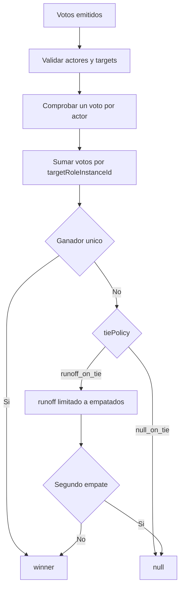

Implementacion actual:

```text
vote_out_of_play = vote + onWinnerAction(set_in_play false)
```

Reglas actuales de esa votacion:

```text
requiredVotes: all_in_play
tiePolicy: null_on_tie
relationRestrictions: prevent_related_target linked
```

La deuda tecnica anterior era que `vote_out_of_play` aplicaba directamente el
efecto desde `actionModel.js`. Eso ya queda separado:

```text
voteModel cuenta votos.
recipeModel ejecuta onWinnerAction si hay ganador.
actionModel resuelve la accion pura configurada.
```

Flujo actual de `vote_out_of_play`:

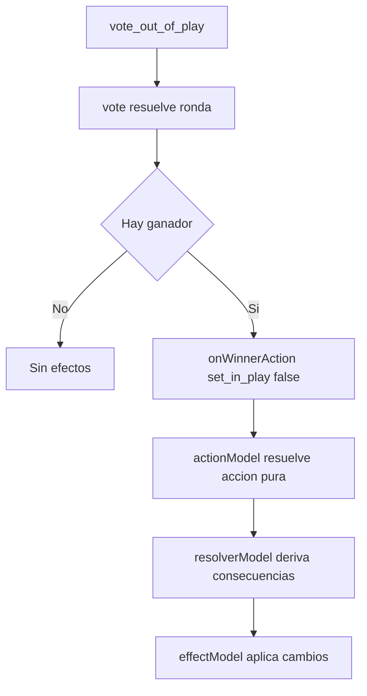

## Regla de orientacion

Si una regla responde a:

```text
puedo intentar hacer esto?
```

probablemente pertenece a `actionModel.js` o `constraintModel.js`.

Si responde a:

```text
que consecuencias tiene este efecto aceptado?
```

probablemente pertenece a `resolverModel.js`.

Si responde a:

```text
como se escribe este cambio?
```

probablemente pertenece a `effectModel.js`.

Si responde a:

```text
ha terminado la partida?
```

probablemente pertenece a `victoryModel.js`.
