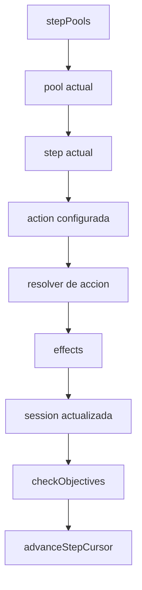
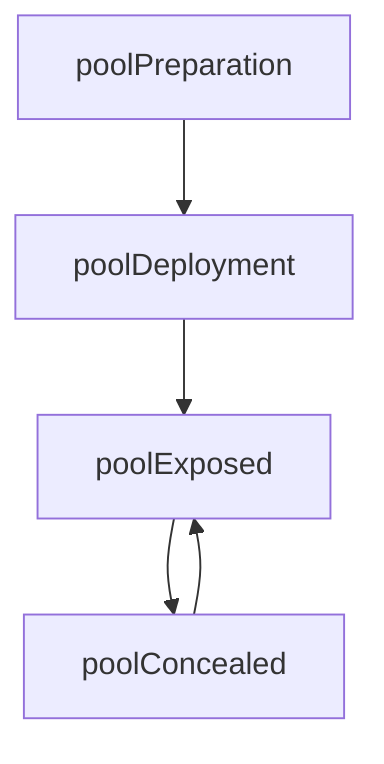

# Logica recuperada de steps

Este documento consolida la logica de steps que ya estaba definida en el
proyecto. No sustituye al motor; sirve para no volver a repensar desde cero el
flujo que ya estaba acotado.

Fuentes revisadas:

- `docs/modelo_objetivo_sesion.md`
- `src/lib/domain/poolCursorModel.js`
- `reference-data/rulesets/turn_overview.md`
- `docs/historial_codex_resumen.md`

## Convenio de palabras

Para evitar el lio entre step, paso y step, usaremos este convenio:

| Palabra | Significado | Ejemplo |
|---|---|---|
| `pool` | bloque grande del ciclo | `poolExposed` |
| `step` | unidad ejecutable dentro de un pool | `stepVoteOutOfPlay` |
| `action` | accion mecanica que ejecuta un step | `obsolete_composite_vote_recipe` |
| `effect` | cambio propuesto o final | `set_property inPlay=false` |
| `cycle` | vuelta completa recurrente | noche/dia actual |

Evitaria usar "step" para todo. Si hablamos tecnicamente:

```text
pool -> step -> action -> effect
```

## Responsabilidad de cada capa



### `poolCursorModel.js`

Solo debe responder:

```text
que step toca ahora?
que step viene despues?
que pool viene despues?
```

No debe contar votos, aplicar efectos, evaluar linked ni decidir objectives.

### `actionModel.js`

Ejecuta la accion configurada por el step actual.

Ejemplo:

```text
stepVoteOutOfPlay -> obsolete_composite_vote_recipe recipe
```

### `objectiveModel.js`

Se consulta despues de consumar efectos relevantes.

Ejemplo:

```text
obsolete_composite_vote_recipe = vote + obsolete_followup_action(set_in_play false)
linked puede propagar inPlay=false
objectiveModel comprueba si hay un playOutcome concluyente
```

## Estructura recuperada de pools

El modelo anterior ya planteaba estos pools:

```text
poolPreparation
poolDeployment
poolExposed
poolConcealed
poolSpecial
```

Lectura:

- `poolPreparation`: preparacion inicial.
- `poolDeployment`: acciones que solo ocurren la primera noche.
- `poolConcealed`: acciones recurrentes de noche.
- `poolExposed`: resolucion diurna recurrente.
- `poolSpecial`: interrupciones o resoluciones que pueden entrar entre pools.

## Orden general recuperado

Segun `turn_overview.md`, el bucle base es:



Con `poolSpecial` disponible para interrupciones:

```text
objectives, acciones finales, efectos retardados, eventos especiales
```

## Pool Each Day

El flujo diurno recuperado contiene:

```text
1. revelar resultados / resolver efectos del ciclo anterior
2. eventos o informacion diurna
3. debate
4. votacion
5. comprobar efectos posteriores a votacion
6. posible segunda votacion por reglas especiales
7. pasar al siguiente pool
```

Para el nucleo limpio, de momento podemos expresarlo asi:

```js
poolExposed: [
  {
    key: 'stepResolveCycleStart',
    status: 'enabled',
    actionId: 'resolve_pending_effects'
  },
  {
    key: 'stepDebate',
    status: 'enabled',
    actionId: null
  },
  {
    key: 'stepVoteOutOfPlay',
    status: 'enabled',
    actionKey: 'obsolete_composite_vote_recipe',
    actionId: 'vote',
    config: {
      tiePolicy: 'null_on_tie',
      requiredVotes: 'all_in_play'
    }
  },
  {
    key: 'stepCheckObjectives',
    status: 'enabled',
    actionId: 'check_objectives'
  }
]
```

`stepDebate` puede ser un step sin accion de motor, usado por la UI para abrir
un estado de conversacion. No es una cascara vacia: organiza el flujo.

## Step Vote Out Of Play

Para la votacion diurna del juego base:

```text
pool: poolExposed
step: stepVoteOutOfPlay
recipe: obsolete_composite_vote_recipe
effect: obsolete_followup_action(set_in_play false)
votan: todos los roleInstances inPlay
obligatorio: si
abstencion: no
empate: null_on_tie
```

Esto significa:

- solo votan roles `inPlay`;
- todos los roles `inPlay` deben emitir un voto;
- cada voto vale una unidad;
- el target con mas votos gana;
- si hay empate, no se aplica ningun efecto;
- tras resolver la votacion, se avanza al siguiente step.

## Restriccion Linked En Votacion

Regla humana:

```text
un rol linked no debe poder votar contra el rol con el que esta linked
```

En UI:

```text
la pantalla no deberia permitir seleccionar al linked como target
```

En motor:

```text
aunque la UI falle o alguien mande datos invalidos, el motor debe rechazar ese voto
```

Por tanto, esta regla no pertenece a `resolverModel` ni a `effectModel`.
Pertenece a la validacion de votos o a un modificador de voto.

Forma candidata:

```js
{
  type: 'exclude_related_target',
  relationType: 'linked'
}
```

El validador comprobaria:

```text
si actorRoleInstanceId esta linked con targetRoleInstanceId
y la receta es obsolete_composite_vote_recipe
entonces el voto es invalido
```

Estado actual: implementado en `voteModel.js` como `relationRestrictions` y
usado por `obsolete_composite_vote_recipe`.

## Votaciones Configurables

Aunque hoy solo hemos conectado `obsolete_composite_vote_recipe`, el modelo deja abierta la
puerta a otras votaciones:

```text
vote_assign_marker
vote_grant_action
vote_set_relation
```

Todas pueden reutilizar `voteModel.js` para contar votos, pero no deben compartir
automaticamente el mismo efecto.

## Siguiente pieza tecnica

Antes de anadir mas roles, conviene implementar dos cosas pequenas:

1. `requiredVotes: all_in_play` en `voteModel.js`. Implementado.
2. restriccion de voto contra relation target para `linked`. Implementado.

Eso cerraria la votacion diurna base:

```text
todos los inPlay votan
no abstencion
no votar a linked
empate sin efecto
chosen -> inPlay=false
```
